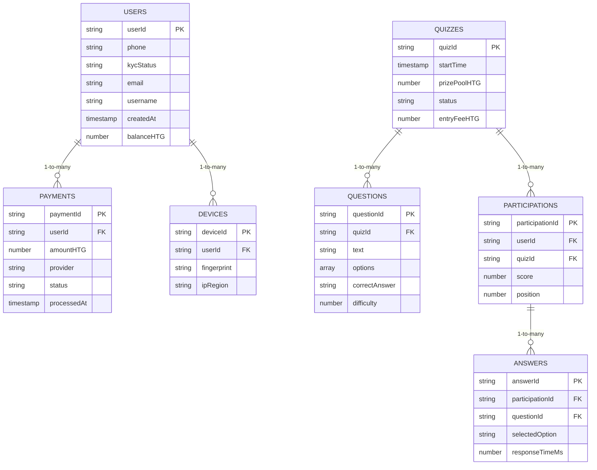

# CashQuiz HT Data Model 🔢

## 🏗 Firestore Collections Structure



---

## 📝 Collection Details

### 1. `users` Collection
```javascript
{
  userId: "HT_50936324587", // Phone-based ID
  phone: "+50936324587",
  email: "user@gmail.com",
  username: "First Lastname"
  kycStatus: "verified", // pending/verified/rejected
  balanceHTG: 1500,
  created_at: firestore.Timestamp.now(),
  deviceIds: ["dvc_a1b2c3"]
}
```

### 2. `quizzes` Collection
```javascript
{
  quizId: "qzy_xyz123",
  startTime: firestore.Timestamp.fromDate(new Date("2025-03-15T19:00:00")),
  prizePoolHTG: 25000,
  entryFeeHTG: 500,
  status: "scheduled", // scheduled/live/completed
  questionIds: ["q_789", "q_790"]
}
```

### 3. `questions` Collection
```javascript
{
  questionId: "q_789",
  quizId: "qzy_xyz123",
  text: "Ki premye minis Ayiti?",
  options: ["Jean-Jacques Dessalines", "Alexandre Pétion", "Toussaint Louverture"],
  correctAnswer: "Toussaint Louverture",
  difficulty: 2, // 1-3 scale
  language: "ht" // ht/fr/en
}
```

### 4. `participations` Collection
```javascript
{
  participationId: "ptp_abc456",
  userId: "HT_50936324587",
  quizId: "qzy_xyz123",
  score: 8,
  position: 3,
  deviceId: "dvc_a1b2c3",
  responseTimes: [1200, 980, 1500] // ms per question
}
```

### 5. `payments` Collection
```javascript
{
  paymentId: "pay_20250315-3",
  userId: "HT_50936324587",
  amountHTG: 2500,
  provider: "moncash",
  transactionId: "MC789XYZ",
  status: "completed", // pending/failed
  processedAt: firestore.Timestamp.now()
}
```

---

## 🔐 Security Rules

```javascript
rules_version = '2';
service cloud.firestore {
  match /databases/{database}/documents {
    match /users/{userId} {
      allow read, write: if request.auth != null && request.auth.uid == userId;
    }
    
    match /quizzes/{quizId} {
      allow read: if request.time < resource.data.startTime;
      allow create: if isAdmin();
    }
    
    match /participations/{participationId} {
      allow create: if hasPaidEntryFee();
      allow update: if isPlayer() && request.resource.data.score == null;
    }
  }
}
```

---

## ⚡ Optimizations for Haiti

1. **Data Minimization**
   - Question texts stored in Kreyòl (avg. 30% smaller than French)
   - Firestore offline persistence enabled

2. **Regional Partitioning**
```javascript
// All queries include region code
db.collection('quizzes')
  .where('region', '==', 'ht_ouest')
  .orderBy('startTime')
```

3. **Batch Operations**
```python
# Django Example
def process_winners(quiz_id):
    batch = db.batch()
    winners = db.collection('participations').where('quizId', '==', quiz_id)
               .order_by('score', direction='DESCENDING').limit(10).stream()
    
    for doc in winners:
        user_ref = db.collection('users').document(doc.userId)
        batch.update(user_ref, {'balanceHTG': firestore.Increment(doc.prize)})
    
    batch.commit()
```

---

## 📊 Analytics Sub-Collections

### `users/{userId}/analytics`
```javascript
{
  date: "2025-03-15",
  quizzesPlayed: 2,
  avgResponseTime: 3200,
  deviceType: "Android 10",
  networkType: "3G" // 2G/3G/4G/WiFi
}
```
