# CashQuiz HT: Project Master File

## 📌 Executive Summary
**A live quiz platform where Haitian users compete in real-time for cash prizes, leveraging mobile money payments and optimized for low-bandwidth connectivity.**

**Key Differentiators:**
- 🕒 Synchronized tournaments (no asynchronous cheating)
- 📱 Mobile-first design (85% of Haitian internet users)
- 🏦 Seamless HTG transactions via MonCash/NatCash

---

## 🎯 Core Functionalities

### 🎮 User Experience
| Feature               | Implementation Details                  | Tech Stack          |
|-----------------------|----------------------------------------|---------------------|
| 1-Click Registration | Phone number + SMS OTP                 | Firebase Auth       |
| Live Quiz Lobby       | Real-time participant count            | Firestore Listeners |
| Answer Submission     | 10-second timer per question           | WebSocket Broadcast |
| Instant Payouts       | Auto-transfer to mobile money          | MonCash API         |

### 🛡️ Security
- **Multi-layer Anti-Cheat**:
  1. Device fingerprinting
  2. Response time analysis (μ=3.2s, σ=1.1s)
  3. Geographic IP validation
- **Data Protection**:
  - End-to-end encryption for payment data
  - Daily Firebase backups to local servers

---

## 👥 User Journeys

### 🧑‍💻 Player Flow

### 🕴️ Admin Flow
1. **Tournament Setup**
   - Define prize pool (5,000-50,000 HTG)
   - Load questions (CSV import)
2. **Fraud Monitoring**
   - Real-time dashboard
   - Manual override capability
3. **Payout Reconciliation**
   - Daily settlement reports

---

## 💼 Business Model

### Revenue Streams
| Source               | Monetization Strategy                  | Projected Monthly (Year 1) |
|----------------------|----------------------------------------|----------------------------|
| Entry Fees           | 15% platform fee on prizes             | 750,000 HTG                |
| Sponsorships         | Branded quizzes (+20% premium)         | 300,000 HTG                |
| Advertising          | 5-second pre-roll videos               | 150,000 HTG                |

### Cost Structure
| Expense              | Monthly Allocation                     |
|----------------------|----------------------------------------|
| Prize Guarantees     | 1,200,000 HTG                          |
| Mobile Money Fees    | 2.5% transaction volume               |
| AWS/Firebase Costs  | $380 USD                               |

---

## 📅 12-Month Projections

### Growth Metrics

```mermaid
gantt
    title User Acquisition Timeline
    dateFormat  YYYY-MM
    section Phase 1
    Port-au-Prince Launch :2025-01, 2025-03
    section Phase 2
    Cap-Haïtien Expansion :2025-04, 2025-06
    section Phase 3
    Nationwide Coverage :2025-07, 2025-12
```

### Financial Outlook
| Quarter | Active Users | Gross Revenue | Net Profit |
|---------|--------------|---------------|------------|
| Q1      | 8,500        | 1.2M HTG      | -180k HTG  |
| Q2      | 22,000       | 3.8M HTG      | 420k HTG   |
| Q3      | 47,000       | 8.1M HTG      | 1.9M HTG   |

---

## ⚠️ Risk Analysis

### Challenges & Mitigations
| Risk                          | Solution                                |
|-------------------------------|-----------------------------------------|
| Payment Gateway Downtime      | Dual integration (MonCash + NatCash)    |
| Cheating Syndicates           | Machine learning pattern detection      |
| Regulatory Changes            | Local legal retainer ($500/month)       |

---

## 🌟 Success Metrics

### KPIs
- **Engagement**:
  - 65% daily active users
  - 4.3 sessions/user/week
- **Financial**:
  - <72hr prize payout cycle
  - 92% payment success rate
- **Growth**:
  - 30% month-over-month signups

---

## 🚀 Launch Roadmap

### Phase 1: MVP (0-3 Months)
- Core quiz functionality
- Basic anti-cheat systems
- Port-au-Prince pilot (500 users)

### Phase 2: Scale (4-6 Months)
- Referral program
- Premium memberships
- Nationwide marketing

### Phase 3: Maturity (7-12 Months)
- Brand partnerships
- Offline tournament events
- Regional expansion (Dominican Republic)

---

## 📬 Contact
**Leadership Team:**
- CTO: Stephane Laine (`slaine@cashquiz.ht`)
- CFO: Ralphy Dumera (`rdumera@cashquiz.ht`)

**Investor Relations:**  
Delmas, Port-au-Prince  
+509 xxxx-xx-xx 

*© 2025 CashQuiz HT - All Rights Reserved*
