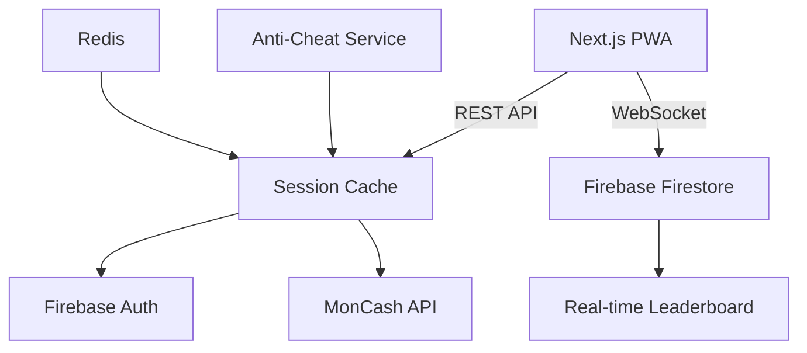

# CashQuiz HT: Live Trivia Platform 🇭🇹

**Synchronized quiz tournaments with cash prizes in HTG, built for Haiti's mobile-first market.**

---

## 🌐 Core Architecture (Django + Firebase)

---

## 🧩 Technical Stack

### 🖥 Frontend (React 18)

| Component          | Technology Stack         | Purpose                                                                 | Haiti-Specific Optimization          |
|--------------------|--------------------------|-------------------------------------------------------------------------|--------------------------------------|
| Quiz Interface     | Chakra UI + Framer       | Mobile-responsive question flows with animations                        | Kreyòl/French language toggle        |
| State Management   | Redux Toolkit            | Centralized store for quiz progress & user balance                      | Offline action queue for 2G/3G       |
| Real-Time Updates  | Firebase SDK             | Live leaderboard and question sync                                      | Throttled updates for low bandwidth  |
| Offline Support    | Service Workers + IndexedDB | Caches questions and handles intermittent connectivity                | 500kb asset budget                   |
| Payment Flow       | MonCash Embedded Checkout | HTG deposit/withdrawal processing                                      | Fallback to NatCash API              |
| Anti-Cheat         | DeviceInfo.js + FingerprintJS | Unique device binding                                              | IP geolocation (Haiti-only)         |

**Key Adaptations for Haiti:**
1. **Lightweight Bundle**  
   - React.lazy() for code splitting  
   - Compressed assets (WebP images, Brotli compression)

2. **Network Resilience**  
   ```javascript
   // Offline answer queuing
   const [submitAnswer] = useMutation(SUBMIT_ANSWER, {
     onError: (err) => {
       if (navigator.onLine === false) {
         queueAnswerInIndexedDB(answer); // Sync when back online
       }
     }
   });

### ⚙️ Backend (Django 5.0)
```python
# apps.py
class QuizzesConfig(AppConfig):
    name = 'quizzes'
    
    def ready(self):
        # Firebase connection
        import firebase_admin
        firebase_admin.initialize_app()
```

### 🔥 Firebase Services
1. **Firestore**
   - Collections: 
     - `live_quizzes/{id}/participants`
     - `questions/{difficulty}`
2. **Authentication**
   - Phone number sign-in (Kreyòl SMS templates)
3. **Functions**
   - HTG payout processing

---

## 🔄 Data Flow
1. **User Registration**
   ```mermaid
   sequenceDiagram
       User->>Next.js: Enters phone number
       Next.js->>Django: POST /verify-phone
       Django->>Firebase Auth: Send SMS OTP
       Firebase Auth-->>User: Kreyòl SMS
   ```

2. **Quiz Execution**
   ```python
   # consumers.py (WebSocket)
   class QuizConsumer(AsyncJsonWebsocketConsumer):
       async def receive_json(self, content):
           if content['type'] == 'answer':
               await self.validate_answer(
                   answer=content['answer'],
                   response_time=content['response_ms']
               )
   ```

---

## 🛡️ Anti-Cheat Measures
| Layer          | Implementation                          | Tools Used                  |
|----------------|----------------------------------------|-----------------------------|
| Device         | Firebase Device Fingerprinting         | `react-device-detect`       |
| Timing         | Question hash rotation (100ms interval) | Django Channels            |
| Behavior       | Response time anomaly detection        | TensorFlow Lite (Edge AI)  |
| Network        | WebRTC IP leak prevention              | `peerjs`                   |

---

## 💰 Payment Integration
### MonCash Deposit Flow
```python
# payments/views.py
def initiate_deposit(request):
    amount = request.POST.get('amount') # 500-1000 HTG
    response = requests.post(
        'https://api.moncash.ht/v1/payments',
        headers={'Authorization': f'Bearer {settings.MONCASH_KEY}'},
        json={
            'amount': amount,
            'phone': request.user.phone,
            'callback': f'{settings.DOMAIN}/payment-callback'
        }
    )
    return JsonResponse(response.json())
```

---

## 🚀 Deployment Strategy
### Phase 1: Web MVP (4 Weeks)
```gantt
    dateFormat  YYYY-MM-DD
    section Core
    Firebase Setup   :done, fb1, 2025-01-01, 7d
    Django API       :active, dj1, 2025-01-08, 14d
    section Frontend
    Quiz UI          : crit, ui1, 2025-01-15, 21d
```

### Infrastructure
```bash
# docker-compose.yml
services:
  django:
    build: .
    ports:
      - "8000:8000"
    env_file: .env.ht
  redis:
    image: redis:alpine
```

---

## 📜 Legal Compliance
- **Data Residency**: Firebase region set to `northamerica-northeast1` (Montreal)
- **Taxation**: 10% withholding on prizes >10,000 HTG
- **KYC**: 
  - Required for withdrawals >5,000 HTG
  - Verified via `NatCash ID Check` API

---

## 📈 Growth Metrics
| Metric               | Target (Month 6) |
|----------------------|------------------|
| MAU                  | 15,000           |
| Avg. Session Duration| 8.5 mins         |
| Payment Success Rate | ≥92%             |

---

## 👥 Team
| Role               | Contact                |
|--------------------|------------------------|
| Tech Lead          | Stephane Laine         |
| Backend Developer  | Ralphy Dumera          |
| Legal Advisor      | [Local Law Firm]       |

**License:** Proprietary | **© 2025 CashQuiz HT**
```
